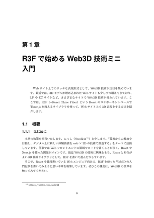

# R3F Introduction for IwakenLab TechBook #3

[技術書典15オンラインマーケット](https://techbookfest.org/event/tbf15/market)で頒布した『[IwakenLab TechBook #3](https://techbookfest.org/product/qhSj8q5L2QbYKVn3hmkDn7)』の1章「R3Fで始めるWeb3D技術ミニ入門」に掲載したサンプルコード用のリポジトリです。

  
  
  

## サンプルコードの成果物

本リポジトリでは、アニメーション付きの3Dモデル（りんご）を表示するWebページを実装します。

## ライセンス

本リポジトリのソースコードはMITライセンスで公開しています。詳細は[LICENSE](/LICENSE)をご覧ください。
